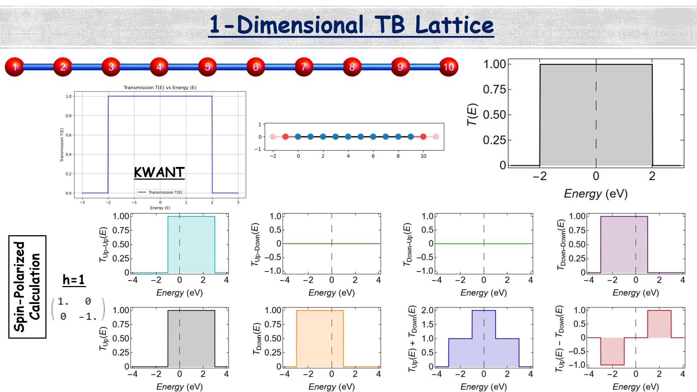
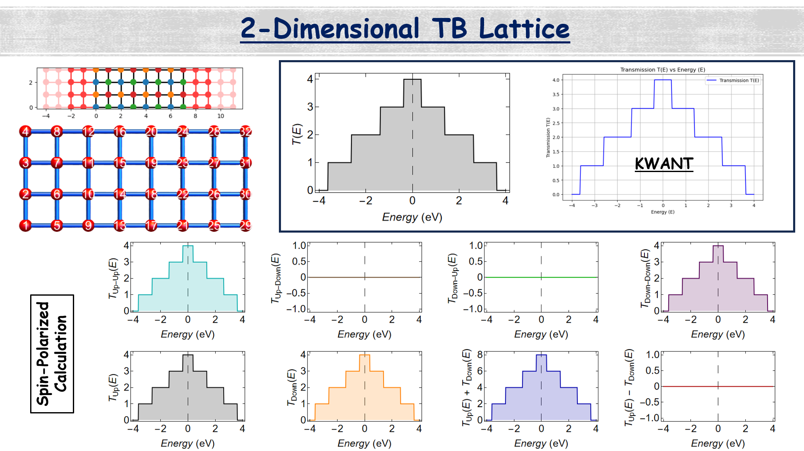
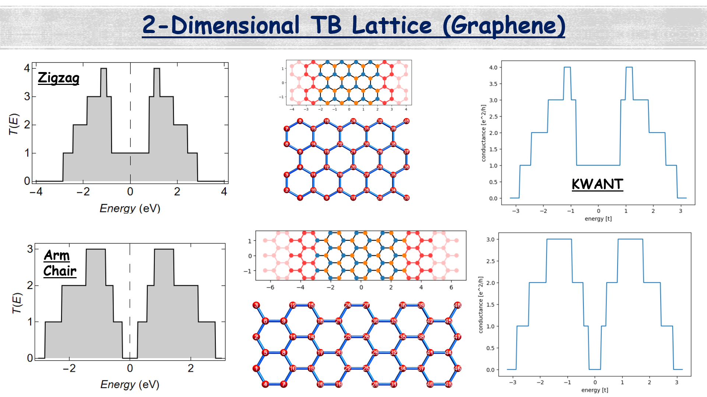
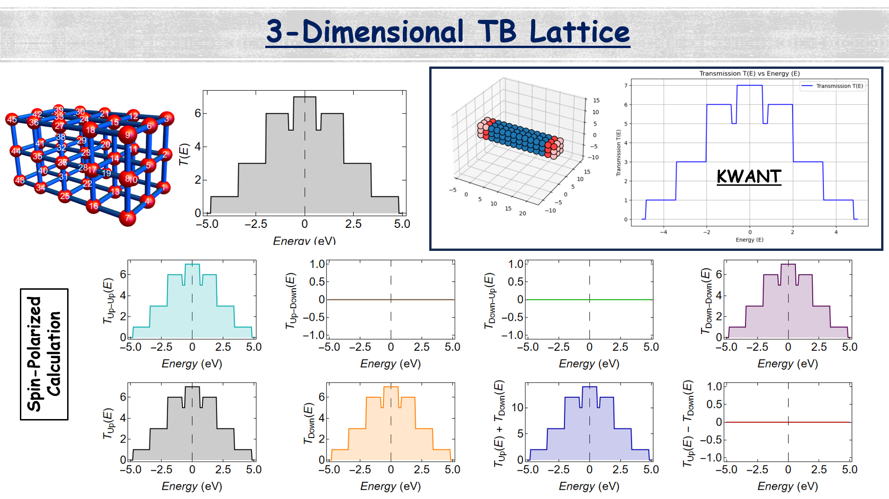

# NEPT
This package provides a computational framework for calculating quantum transport properties using the Non-Equilibrium Green's Function (NEGF) formalism. It supports simulations of both electronic and phononic transport in nanoscale systems.

  ## Installation
  Installation guide will be provided soon...

  ## Overview

  

  

  

  

  

  

  

  

